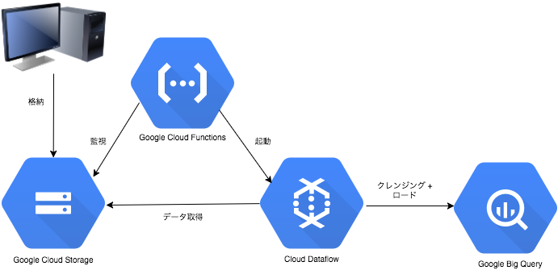

# DEMO

## 概要
* GCSへのファイル格納をトリガーに、DataFlowでの簡単なデータクレンジング、BigQueryへのロードを行います。

* 格納検知、DataFlow起動は、CloudFunctionsを利用しています。

[DataFlow 参考ページ](https://cloud.google.com/dataflow/?hl=ja)

[CloudFunctions 参考ページ](https://cloud.google.com/functions/?hl=ja)




* 以下のケースにて利用が考えられます。
  * データ量が爆発的に増加して、ローカルPC 1台では定期バッチが指定時間以内に終わらない
  * PCでの処理を出来る限り、ソースコードベースにして汎用化したい

* 今回のsampleでは、INTEGER型のColumnに、それ以外の型が混入した場合（`aaa`など）、`0`を代入する処理になっています。

## DataFlow

1. DataFlowAPIの有効化

https://console.cloud.google.com/apis/api/dataflow.googleapis.com/overview?project= [your Project id]

2. Templateの作成

```
cd dataflow
```
```
mvn compile exec:java -Dexec.mainClass=com.example.LoadBigQuery \
-Dexec.args=\
"--project=<< your project id >> \
--stagingLocation=<< staging location >> \
--runner=TemplatingDataflowPipelineRunner \
--inputFile=<< input file >> \
--bigQueryDataset=<< target dataset >> \
--dataflowJobFile=<< template file >>"
```

* 指定するバケットは、先に作成されている必要があります

* stagingLocation 
  * dataflow実行ファイル(jar)の格納する場所の指定してください
  * 例 `gs://example/stg`

* inputFile
  * 入力Fileが格納されている場所を指定してください
  * 例 `gs://example-input/test.csv`
    * CloudFunctionsで指定する監視バケットの配下を指定してください

* bigQueryDataset
  * 出力先のDatasetを指定してください
  * 例 `test`
    * 出力先のデータセットは先に作成されている必要があります
    * テーブルに関しては作成不要です

* dataflowJobFile
  * dataflowのtemplateを格納する場所を指定してください
  * templateを参照して、使い捨ての実行ファイルが作成される
  * 例 `gs://example/templates/LoadBigQuery`

## CloudFunctions

1. CloudFunctions APIの有効化

https://console.cloud.google.com/apis/api/cloudfunctions.googleapis.com/overview?project=[your Project id]

2. config.jsonの編集

* PROJECT_ID
  *  ProjectIDを記入して下さい
* DATAFLOW_TEMPLATE_PATH 
  *  dataflowJobFileで指定したPATHを記入してください
  *  例 `gs://example/templates/LoadBigQuery`

2. CloudFunctionsのデプロイ

```
cd functions
```
```
npm install && npm run build
```
```
gcloud beta functions deploy dataflowJob --stage-bucket << stage bucket >> --trigger-bucket << trigger bucket >>
```
* stage-bucket
  * dataflowの実行ファイル(.js)が格納される場所を指定してください
  * 例 `gs://example`

* trigger-bucket
  * 監視対象のバケットを指定してください
  * このバケットに変更があると、デプロイしたjsが起動
  * 各実行ファイルと同じバケットにすると、デプロイの度に起動するため独立したバケットが推奨されている
    * ここに格納されたfileを指定されたデータセットに格納します。
  * 例 `gs://example-input`

## 起動

* 該当のcloud storageにファイルを格納すると起動します

```
gsutil cp test.csv << trigger bucket >>
```

## 停止
* 以下のコマンドで停止します。
    * 停止するまで監視を続けます。

```
gcloud beta functions delete dataflowJob
```

